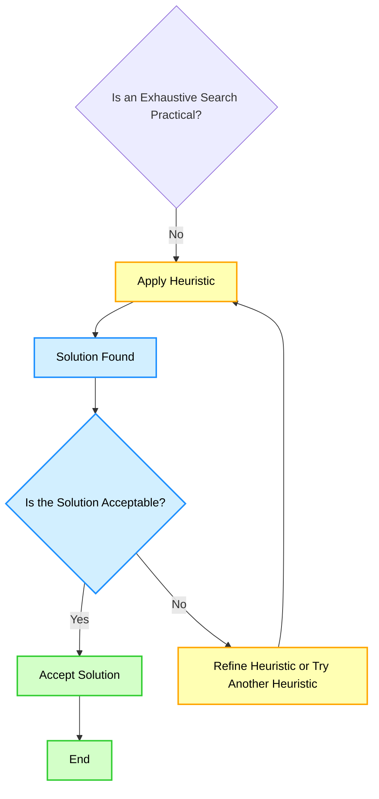

```mermaid
flowchart TD
    D{Is an Exhaustive Search Practical?}
    D --> |No| G[Apply Heuristic]
    G --> H[Solution Found]
    H --> I{Is the Solution Acceptable?}
    I --> |Yes| J[Accept Solution]
    J --> K[End]
    I --> |No| L[Refine Heuristic or Try Another Heuristic]
    L --> G

    style G fill:#FFFFB3,stroke:#FFA500,stroke-width:2px,color:#000000
    style H fill:#D2EFFF,stroke:#1E90FF,stroke-width:2px,color:#000000
    style I fill:#D2EFFF,stroke:#1E90FF,stroke-width:2px,color:#000000
    style J fill:#D3FFC8,stroke:#32CD32,stroke-width:2px,color:#000000
    style K fill:#D3FFC8,stroke:#32CD32,stroke-width:2px,color:#000000
    style L fill:#FFFFB3,stroke:#FFA500,stroke-width:2px,color:#000000
```