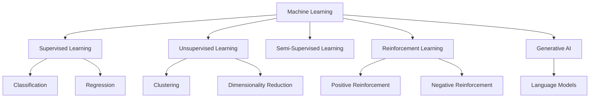

```mermaid
flowchart TD
    A[Machine Learning]
    A --> B[Supervised Learning]
    A --> C[Unsupervised Learning]
    A --> D[Semi-Supervised Learning]
    A --> E[Reinforcement Learning]
    A --> F[Generative AI]

    B --> B1[Classification]
    B --> B2[Regression]

    C --> C1[Clustering]
    C --> C2[Dimensionality Reduction]

    E --> E1[Positive Reinforcement]
    E --> E2[Negative Reinforcement]

    F --> F1[Language Models]
```